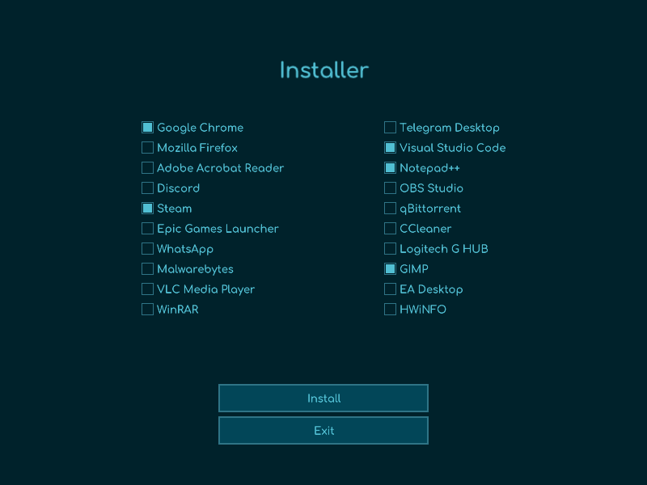
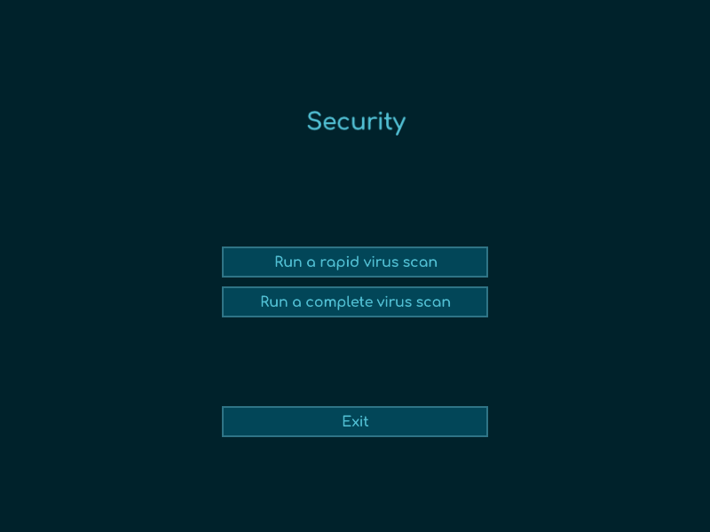
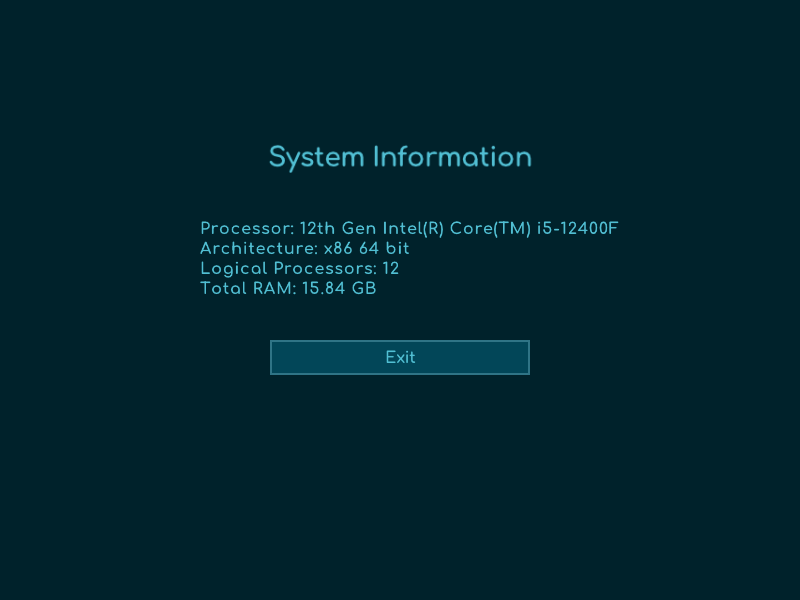

#  Lufrak 🌟

**Get the most out of your Windows PC with simplicity and security.**

---

## 🚀 Introduction

**Lufrak** is your personal assistant for configuring and optimizing Windows 10/11. Forget about complicated, long, and boring manual configurations, Lufrak makes everything quick, easy, and suitable for everyone, from beginners to experts.

---

## ✨ Main Features

- 🔍 **Intuitive Interface:** Simple and user-friendly navigation.
- 🛡️ **Secure Tools:** Uses all Windows-approved components, such as `winget`, to ensure full compatibility.
- 💻 **Open-Source Code:** All code is public and verifiable on [GitHub](https://github.com/landiluigi746/Lufrak).

---

## 🎁 Advantages

- 🚀 **Quick Installation:** Configure your PC in just a few minutes.
- ⚡ **Intelligent Optimization:** Improve performance with just one click.
- 📊 **System Information:** View the most important statistics about your computer.

---

## 🖼️ Screenshots

| Installer              | Security               | System Info            |
|------------------------|------------------------|------------------------|
|  |  |  |

---

## 🛠️ Getting Started

You can download Lufrak in two ways:

- **Download the executable from the last [release](https://github.com/landiluigi746/Lufrak/releases/tag/v1.0):**

1. **Download Lufrak.zip** from [here](https://github.com/landiluigi746/Lufrak/releases/tag/v1.0).
2. Extract the contents of the zip file.
3. **Install the contents of the Redist folder.**
4. **Run the Lufrak.exe file** and discover all the features of our optimizer.
5. Enjoy setting up and optimizing your PC in just a few minutes!

- **Clone the repository and build it yourself:**
```bash
git clone https://github.com/NomeUtente/Lufrak.git
cd Lufrak
```

---

## 👥 Development Team

| [Luigi Landi](https://github.com/landiluigi746) | [Francesco Gaeta](https://github.com/KeKK0z) |
|---|---|

> 📝 **Note:** Lufrak is an independent project, not affiliated with Microsoft.

---

## 📬 Contacts

Have questions or suggestions? Open a [GitHub Issue](https://github.com/landiluigi746/Lufrak/issues) or contact us directly!

---

<p align="center">❤️ Thanks for choosing Lufrak! Contribute to the project with a ⭐ on GitHub!</p>